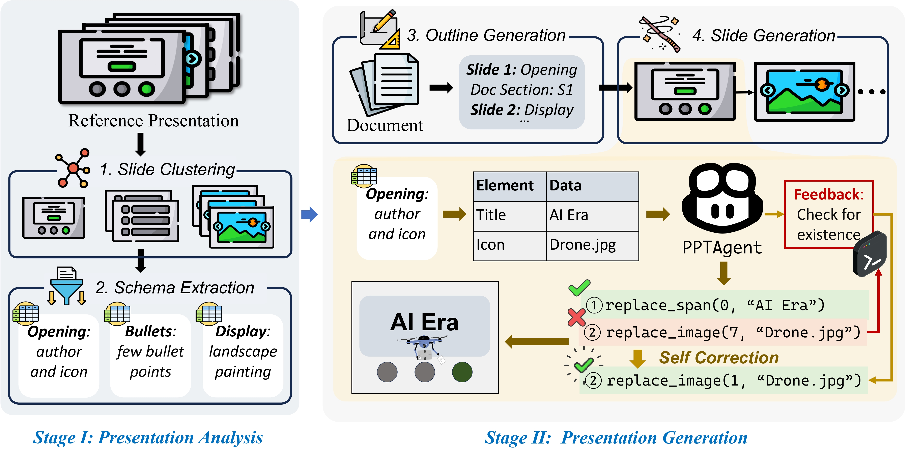
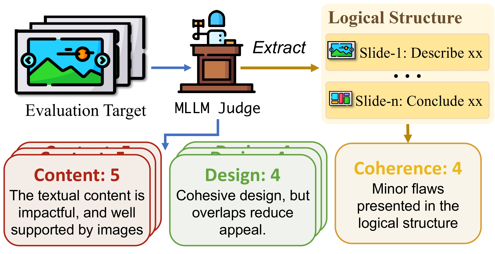

# PPTAgent: Generating and Evaluating Presentations Beyond Text-to-Slides

<p align="center">
  📄 <a href="https://arxiv.org/abs/2501.03936" target="_blank">Paper</a> &nbsp; | &nbsp;
  🤗 <a href="https://huggingface.co/datasets/Forceless/Zenodo10K" target="_blank">Dataset</a> &nbsp; | &nbsp;
   📰 <a href="#citation" target="_blank">Citation</a>
</p>

We present **PPTAgent**, an innovative system that automatically generating presentations from documents. Drawing inspiration from human presentation creation methods, our system employs a two-step process to ensure excellence in content quality, visual design, and structural coherence. Additionally, we introduce **PPTEval**, a comprehensive evaluation framework that assesses presentations across multiple dimensions.

## Demo Video🎥

Watch the demo video to see PPTAgent in action:

https://github.com/user-attachments/assets/c3935a98-4d2b-4c46-9b36-e7c598d14863

## Distinctive Features✨

- **Dynamic Content Generation**: Creates slides with seamlessly integrated text and images
- **Smart Reference Learning**: Leverages existing presentations without requiring manual annotation
- **Comprehensive Quality Assessment**: Evaluates presentations through multiple quality metrics

## PPTAgent🤖

PPTAgent follows a two-phase approach:
1. **Analysis Phase**: Extracts and learns from patterns in reference presentations
2. **Generation Phase**: Develops structured outlines and produces visually cohesive slides

Our system's workflow is illustrated below:




## PPTEval⚖️

PPTEval evaluates presentations across three dimensions:
- **Content**: Check the accuracy and relevance of the slides.
- **Design**: Assesses the visual appeal and consistency.
- **Coherence**: Ensures the logical flow of ideas.

The workflow of PPTEval is shown below:



## Case Study💡

- #### [Iphone 16 Pro](https://www.apple.com/iphone-16-pro/)

<div style="display: flex; flex-wrap: wrap; gap: 10px;">

  

  

  

  

  

  

  

</div>

- #### [Build Effective Agents](https://www.anthropic.com/research/building-effective-agents)

<div style="display: flex; flex-wrap: wrap; gap: 10px;">

  

  

  

  

  

  

  

  


</div>

## Reproduce the evaluation🧪

1. Requirements
```sh
pip install -r requirements.txt
sudo apt install libreoffice
# brew install libreoffice
sudo apt install poppler-utils
# conda install -c conda-forge poppler
```

2. Reproduce the pptxs according the saved history files.
```sh
python rebuild.py rebuild_all --out_filename "final.pptx"
```

3. Parse the pptxs to images to prepare for evaluation.
```sh
python evals.py pptx2images
```

4. Evaluate the pptxs.
```sh
python evals.py eval_experiment -s 0 -j 0
```

## Citation🙏

If you find this project helpful, please use the following to cite it:
```bibtex
@misc{zheng2025pptagentgeneratingevaluatingpresentations,
      title={PPTAgent: Generating and Evaluating Presentations Beyond Text-to-Slides},
      author={Hao Zheng and Xinyan Guan and Hao Kong and Jia Zheng and Hongyu Lin and Yaojie Lu and Ben He and Xianpei Han and Le Sun},
      year={2025},
      eprint={2501.03936},
      archivePrefix={arXiv},
      primaryClass={cs.AI},
      url={https://arxiv.org/abs/2501.03936},
}
```
